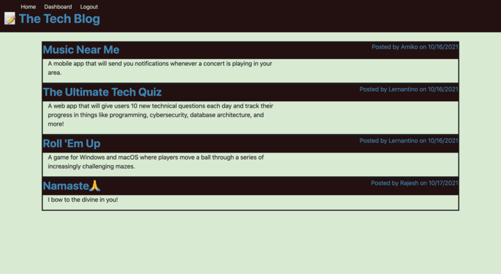
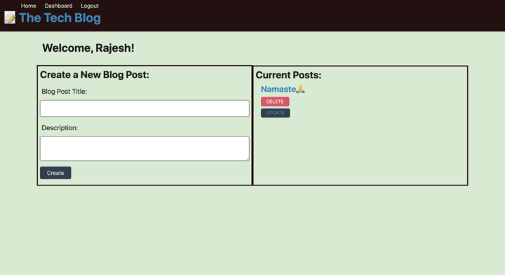
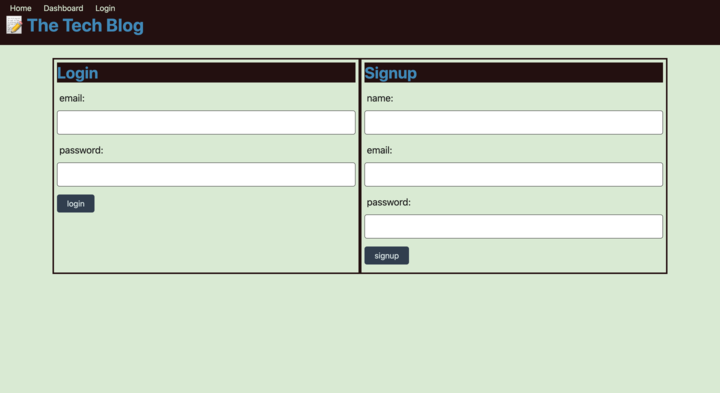
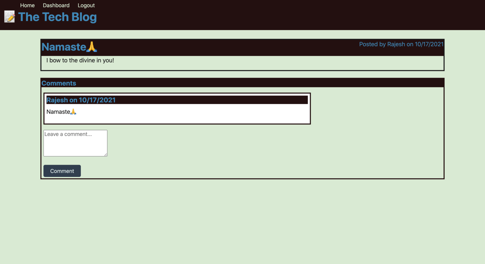
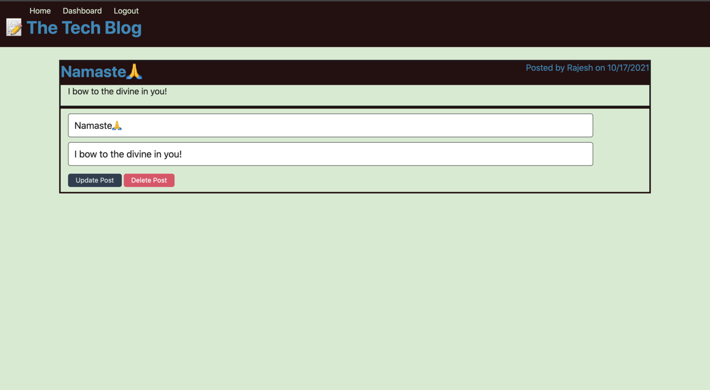

# Model-View-Controller (MVC): Tech Blog

It is a CMS-style blog site similar to a Wordpress site, where developers can publish their blog posts and comment on other developers’ posts as well. This App is based on the MVC paradigm in its architectural structure, using Handlebars.js as the templating language, Sequelize as the ORM, and the express-session npm package for authentication.

## User Story

```md
AS A developer who writes about tech
I WANT a CMS-style blog site
SO THAT I can publish articles, blog posts, and my thoughts and opinions

```

## Deployed Heroku Link:
 ### [MVC Tech Blog!](https://safe-waters-62977.herokuapp.com)


## Screenshots:
  ### Home page
  

 ### Dashboard page
  

 ### Login/Logout page
  

 ### Comment page
  

 ### Edit page
  


## Technologies 
- [express-handlebars](https://www.npmjs.com/package/express-handlebars) package to implement Handlebars.js for Views.
- [MySQL2](https://www.npmjs.com/package/mysql2) packages to connect to a MySQL database for  Models.
- [Sequelize](https://www.npmjs.com/package/sequelize) create an Express.js API for Controllers.
- [dotenv package](https://www.npmjs.com/package/dotenv) to use environment variables.
- [bcrypt package](https://www.npmjs.com/package/bcrypt) to hash passwords.
- [express-session](https://www.npmjs.com/package/express-session) packages to add authentication &
- [connect-session-sequelize](https://www.npmjs.com/package/connect-session-sequelize) packages to add authentication
- [express-session](https://www.npmjs.com/package/express-session) package stores the session data on the client in a cookie. 


## Links :
* Link for the deployed application on heroku [The Tech Blog!](https://safe-waters-62977.herokuapp.com)
* Link for the Github repository [Host by Github](https://github.com/Rajesh295-dev/TheTechBlog)

## Contributor:

* [Rajesh Gautam](https://github.com/Rajesh295-dev)
---

